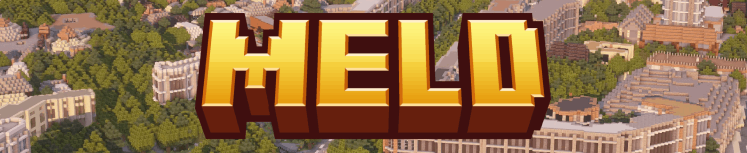

<div align="center">



Turn an OpenStreetMap selection into one seamless Minecraft world. Meld tiles the area, builds
every tile in parallel, and melds them with no height cliffs and no seams. From a city block to a
whole continent.

&nbsp;
&nbsp;
&nbsp;
&nbsp;

**Windows · macOS · Linux**

</div>

Meld is a real world Minecraft world generator. You draw an area on a map, pick a cell size, and
Meld splits the selection into region aligned tiles, generates each tile in parallel with a custom
[Arnis fork](https://github.com/Teddy563/arnis), and merges every tile into one master world. Every
seam lands on a Minecraft region boundary, so the join is exact and the surface is about 99 percent
seamless. Cities, regions, whole continents, built as one world.

> Meld is an orchestrator, not a new generator. It drives [Arnis](https://github.com/louis-e/arnis)
> to build the blocks, then handles the hard part: tiling, a shared OSM fetch, one global elevation
> lock, and a region perfect merge. The win is scale and reliability on a single PC.

The headline is **scale**: build a whole city, country, or continent as one seamless world, with no
seams and no height cliffs at the joins. On the same area Meld runs about **2x faster** than a single
Arnis pass, because it builds the tiles in parallel rather than one after another. The ceiling on
that speed is how fast your disk can save the regions, not your CPU. Meld 1.1.0 also closes the
reliability gaps that show up at large scale: it repairs the elevation no-data holes that caused dark
bands and in-game dips, smooths water artifacts, removes duplicate block entities on the parallel
path, and fixes the crashes that big parallel runs could hit. **1.2.0** takes it offline and faster:
bake a region's OSM once from local `.pbf` files and generate with zero Overpass calls, skip the
supplementary building fetch that dominated per-cell time, reuse cached map tiles across overlapping
selections, and fix the diagonal water/sand wedges near cell edges.

**New here?** Read the [docs](https://meldmc.com/docs) or try the
[live preview](https://meldmc.com/demo), an interactive, simulated copy of the app.

**Docs.** The full guide lives at the [docs hub](https://meldmc.com/docs). In this repo, the
[`docs/`](docs/) folder holds the per-release deep dives (start with
[`docs/whats-new-1.2.0.mdx`](docs/whats-new-1.2.0.mdx)), and [RELEASE-NOTES.md](RELEASE-NOTES.md)
has the highlights of each release.

---

## What you get

| Feature | What it does |
|---|---|
| **Region perfect merge** | Every cell boundary is snapped to a Minecraft region edge, so tiles join exactly. About 99 percent seamless surface, no height cliffs. |
| **Custom Arnis fork** | Meld ships a fork of Arnis with a `--download-only` OSM mode and tile invariant rendering, so neighbouring cells agree on terrain and scatter. |
| **Shared OSM prefetch** | The selection's OpenStreetMap data is downloaded once and reused by every cell, so parallel runs never hit the Overpass rate limit. |
| **Parallel workers** | Builds many Arnis instances at once. Default 4, up to 16, with a one click **Recommend** that tunes cell size and workers to your CPU, RAM, and save disk. |
| **One elevation lock** | A single global elevation range plus a tile invariant seed, so terrain height and building or scatter choices match on both sides of every border. |
| **Region data packs** (1.1.0) | Download a whole region's elevation once into a shared cache, then generate offline with no rate limits. Check coverage, preview the height map, or import a folder of tiles. |
| **Height preview** (1.1.0) | A grayscale or hillshade overlay of the cached elevation right on the map. Red means a tile is not cached yet. Click a tile to see its height range and status. |
| **Elevation detail** (1.1.0) | Pick the terrarium zoom, or let Auto match it to your scale (1:1 picks the finest, 1:10 picks a lighter, lossless one). Lower zoom is far fewer tiles and dodges the no-data gaps. |
| **No-data hole repair** (1.1.0) | The source data has gaps at the highest zooms that looked like dark bands and in-game dips. Meld rebuilds them from a lower zoom that has data, for one tile, a selection, or the whole cache. |
| **No-buildings mode** (1.1.0) | A **Buildings** toggle for a roads and land-cover only world. Roads, bridges, railways, water, natural, and terrain all stay; building footprints are emptied so land cover fills in cleanly. |
| **Road detail + flat bridges** (1.1.0) | A **Road detail** mode (auto, max, clean, or compact) keeps roads legible at small scales by dropping footways, crossings, and lane clutter. At scale 0.3 or smaller, bridges become a flat one-block deck so tall arches do not collapse into noise. |
| **OSM data packs** (1.2.0) | Bake a whole region's OpenStreetMap data once from local Geofabrik `.pbf` files, so generation needs no Overpass at all. Pairs with elevation packs for a fully offline region. Needs the optional `osmium` package. |
| **Reusable OSM cache** (1.2.0) | Map data is cached on a fixed map grid, so overlapping selections share tiles. Shift your area and only the new edge downloads; re-run the same area and nothing does. |
| **Faster cells** (1.2.0) | The supplementary Overture building fetch (about 93 percent of a roads-only cell's time) is skipped with buildings off and cached to disk with them on; each cell reads its map tiles directly with no merge step, and the terrain warm is skipped when elevation is already cached. |
| **Remembered selection** (1.2.0) | Your drawn area and its cells save into each world and redraw on a server restart, per world. |
| **LOD ready** | Chunk lighting is baked in, so distant chunks render lit in Distant Horizons and Voxy without flying the whole world first. |
| **Resume and retry** | Re-run only unfinished cells after a stop, click one cell to regenerate it, and keep many worlds in your saves folder. |

---

## Quickstart

```bash
git clone https://github.com/Teddy563/meld
cd meld
pip install -r requirements.txt
python server.py        # then open http://127.0.0.1:5630
```

Get the **generator**: use the bundled `arnis.exe`, or download the latest from the
[Teddy563/arnis releases](https://github.com/Teddy563/arnis/releases) and drop the binary next to
`server.py`. Pillow is optional, only the automatic elevation survey needs it.

> **Linux / macOS:** the binary must be named **`arnis`** (no `.exe`) and be the matching OS
> build - Meld runs whatever it finds, and a Windows `.exe` here fails with `Exec format error`.
> If you build the fork yourself, use **`cargo build --release --no-default-features`**: the
> default `gui` feature pulls in Tauri/GTK/cairo system libraries (the `cairo-gobject` /
> `PKG_CONFIG_PATH` error), and Meld only needs the headless CLI - `--no-default-features` skips
> all of that and builds clean. Or just download the prebuilt Linux binary and rename it `arnis`.

Then, in the app: draw an area, set the cell size in Settings, and hit **Generate and merge**.

> Windows: double click `start.bat`. macOS or Linux: run `./start.sh`. Both just launch
> `python server.py`. The port is `5630`, or set `PORT` to override it.

---

## How it works

1. **Origin.** Anchor a project origin, one lat/lon snapped to a region corner. Every cell is
   measured from it, so the whole world shares one coordinate convention.
2. **Survey.** Lock one global elevation range and seed for the area, so heights and choices are
   consistent across every tile.
3. **Plan.** Split the selection into a grid of region aligned cells at your chosen cell size.
4. **Prefetch.** Download the OSM data once for the whole selection, then feed it to every cell.
5. **Generate.** Build the cells in parallel with the Arnis fork, bounded by a worker pool.
6. **Merge.** Strip each cell to its canonical regions and write them into the master world, with a
   drift guard so nothing overlaps.

---

## Project layout

```
server.py            Flask orchestrator + the HTTP API
src/
  coords.py          the coordinate convention (origin anchored)
  grid.py            selection bbox to region aligned cell list
  prefetch.py        ensure each cell's OSM grid tiles are cached, then point cells at the cache dir
  osm_grid.py        the stable web mercator OSM tile grid (filenames, bbox math, bake merge)
  osm_pack.py        bake OSM offline from local Geofabrik .pbf files (pyosmium)
  datapack.py        bulk elevation download, coverage, and no-data hole repair
  arnis_cmd.py       build the Arnis argv, run it, find the world dir
  merge.py           canonical region strip + drift guard
  survey.py          elevation min/max (Pillow optional)
  workers.py         bounded parallel worker pool
  project.py         project.json + grid.json state
  level_dat.py       master level.dat handling
  constants.py       shared defaults
web/index.html       the Leaflet app UI served by Flask
experimental/        headless tools (region repair, full re-run, wedge scan) for power users
tests/               coordinate round trip tests
```

---

## Caveats

- **The save phase is the bottleneck**, not the CPU. Each cell writes its region files in one
  burst, so very large cells or very high worker counts can saturate a slow disk. Meld defaults to
  cell size 4 and a low worker count, and **Recommend** tunes both to your machine.
- **One Arnis binary required.** Meld will not generate without `arnis.exe` (or `arnis`) next to
  `server.py`. The app says so on startup if it is missing.

---

## Releases

Versioned with [SemVer](https://semver.org). See [CHANGELOG.md](CHANGELOG.md) for the full history
and [RELEASE-NOTES.md](RELEASE-NOTES.md) for the highlights of each release. Tag a release as
`vX.Y.Z`; the matching CHANGELOG section is the release body.

---

## Credits

Built on the open source [Arnis](https://github.com/louis-e/arnis) generator by louis-e. Meld drives
a [custom Arnis fork](https://github.com/Teddy563/arnis) for the shared OSM prefetch and tile
invariant rendering that make the tiles line up. Respect the upstream Arnis license for the
generator.

Not affiliated with Mojang AB or Minecraft.
